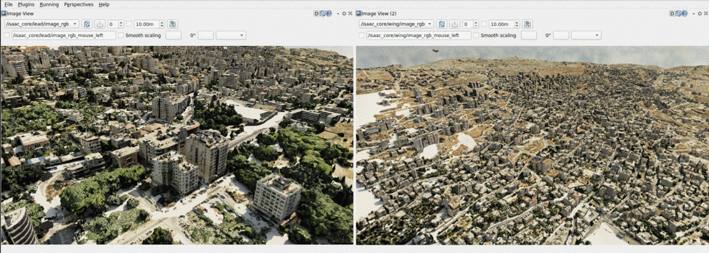

# isaac_core 🌍

Fly a camera over real-world 3D terrain in NVIDIA Isaac Sim 6, driven by position and orientation
sent from your own source.

You give it a latitude, longitude, altitude and attitude, over a UDP packet or a ROS2 topic, and
it puts a camera there, above streamed Cesium 3D Tiles terrain. It publishes the camera image, the
camera's geodetic pose and an RTSP video stream, plus optional robotics and computer-vision features & capabilities.
Everything is configured in a single TOML file, while still allowing adding features without changing the source code.


---

## Contents 📑

- [System requirements](#system-requirements)
- [Installation](#installation)
- [Running the simulation](#running-the-simulation)
- [Features](#features)
- [ROS2 topics](#ros2-topics)
- [The UDP pose packet](#the-udp-pose-packet)
- [Conventions](#conventions)
- [Configuration](#configuration)
- [Scripting with the devkit](#scripting-with-the-devkit)
- [Debug tools](#debug-tools)
- [Adding your own feature layer](#adding-your-own-feature-layer)
- [Troubleshooting](#troubleshooting)
- [Development](#development)
- [Further documentation](#further-documentation)

---

## System requirements 🖥️

<details>
<summary><b>NVIDIA Isaac Sim 6.0.1 or newer</b></summary>

This repo was developed & tested on 6.0.1-rc.7.

Isaac Sim 6.0.1 install guide:

At this link you can download Isaac sim version 6.0.1 for Linux(x86_64) as a zip:
https://docs.isaacsim.omniverse.nvidia.com/6.0.1/installation/download.html

Then unzip it to `~/isaacsim`:
```bash
mkdir ~/isaacsim
cd ~/Downloads
unzip "isaac-sim-standalone-6.0.1-linux-x86_64.zip" -d ~/isaacsim
```

After unzip'ing you should run the post install script (only once after installing per machine):
```bash
cd ~/isaacsim
./post_install.sh
```

At this point you should be set to run Isaac Sim 6.0.1 for the first time:
```bash
cd ~/isaacsim
./isaac-sim.sh
```

</details>

<details>
<summary><b>System Python 3.10</b></summary>

Isaac Sim bundles inside of it python 3.12.
On top of Isaac Sim's Python you should have Python 3.10 installed locally on your machine:
```bash
sudo apt update
sudo apt install -y python3.10 python3.10-dev
```

In order to check your local python version:
```bash
which python3   # usually something like: /usr/bin/python3
python3 --version
```

</details>

<details>
<summary><b>A GPU that Isaac Sim 6 supports</b></summary>

NVIDIA officially recommend the latest version of NVIDIA's driver for your GPU.
You should install GPU driver version 580+ in order to run Isaac Sim 6.0.1

Start by removing your current GPU driver:
```bash
sudo apt-get remove --purge '^nvidia-.*'
```
Next install your desired GPU driver:
```bash
sudo apt update
sudo apt install nvidia-driver-580
```
At this point your new GPU driver should be set, reboot and verify:
```bash
sudo reboot
nvidia-smi | grep -i "Driver Version"
```

</details>

<details>
<summary><b>A Cesium 3D Tiles server</b></summary>

The terrain is streamed live, so you need a tileset URL your simulation machine can reach - or your own locally hosted tileset server:

```toml
[cesium]
tileset_server_url = "http://10.44.134.160:8088"
```

Without a reachable tileset the simulator still runs and the camera still moves, but you will see no ground.

</details>

<details>
<summary><b>Local apt packages</b></summary>

```bash
# Needed for the pose-sender GUI
sudo apt install python3-tk
```

</details>

<details>
<summary><b>ROS2 Humble - optional</b></summary>

Only needed for ROS2 pose input and for output publishing topics. Everything else, including the UDP pose input and the RTSP stream, works without it.
You can follow the installation guide here:
https://docs.ros.org/en/humble/Installation/Ubuntu-Install-Debs.html
make sure you install the full desktop package:
```bash
sudo apt install ros-humble-desktop-full
```

</details>

---

## Installation 📦

```bash
./scripts/setup.sh [--isaac-path /path/to/isaacsim]
```

Five steps the script runs, in order:

1. `pip install --user -r requirements.txt` - runtime dependencies into system Python
2. `pip install --user -e .` - this package into system Python
3. `$ISAAC_PATH/python.sh -m pip install -e ".[sim]"` - the same package into Isaac Sim's embedded Python 3.12
4. `scripts/link_extensions.sh` - symlink the OmniGraph extensions into `extsUser`
5. `colcon build --packages-select isaac_core_ros2_msgs` - build the custom ROS2 messages
   (skipped if you have no ROS2)

Then check the environment:

```bash
isaac-core doctor
```

`doctor` reports what it found, what it could not find, and the exact command to fix each problem. It
is the first thing to run when something is wrong.

<details>
<summary><b>Using it from your own project, without cloning this repo</b></summary>

You do not have to work inside this repo. A separate project can install the package and bring only
what is specific to it: its own scene, its own scripts, and its own feature layers.

```bash
pip install --user 'isaac-core[devkit] @ git+https://github.com/JerichoGroup/isaac_core_6'
```

The shipped scene and the four shipped layers travel with the package, so `isaac-core run` works
immediately. Point it at your own scene by path, and at your own layers by directory:

```toml
[sim]
scene = "/home/you/my_project/terrain.usda"

[assets]
layer_search_paths = ["/home/you/my_project/layers"]
```

Or from Python, with no config file at all:

```python
Sim.launch(overrides={"sim.scene": "/home/you/my_project/terrain.usda"})
```

Your project still needs Isaac Sim itself, the extensions symlinked into it, and the custom ROS 2
messages if you want the `bbox` topic. `scripts/setup.sh` does those from a clone; run
`isaac-core doctor` to see which are missing and what to run.

</details>

---

## Running the simulation 🚀

```bash
isaac-core run
```

That opens the `earth` scene, mounts a camera, and starts the control plane on `127.0.0.1:8760`.
Add `--set sim.headless true` for no window.

Now send it a pose. In a second terminal:

```bash
python3 ./scripts/send_test_pose.py hold
```

The camera holds at the scene's reference point (32.22481 N, 35.25621 E, 1000 m) at 30 Hz until you
press Ctrl+C.

<details>

<summary><b>To fly instead:</b></summary>

```bash
python3 ./scripts/send_test_pose.py orbit --radius-m 800 --duration-s 60
python3 ./scripts/send_test_pose.py path --speed-mps 50
```

</details>

### Confirm it is working

Read the live pose out of the running stage:

```bash
isaac-core-inspect --poll 0.5
```

Expected output (numbers depend on what you sent):

```
    #          Translate (x, y, z)               Quaternion (w, x, y, z)
    1  T=(     0.000,      0.000,    483.300)  Q=(0.6830, -0.1830, 0.1830, 0.6830)
```

If those numbers change as you fly, the pipeline works. `Translate z` is your altitude minus the
scene's reference altitude: 1000 − 516.7 = 483.3.

---

## Features

Features are switched on in `[features] enabled`, except the camera, which follows the vehicle's
`pose_source`. A default run gives you the UDP camera.

<details>
<summary><b>Camera and pose input</b></summary>

The camera is mounted per vehicle and driven by whichever pose source you choose:

```toml
[vehicles.drone_0]
pose_source = "udp" # or "ros"

[vehicles.drone_0.cameras.eo]
fov_deg = 60.0
resolution = [1280, 720]
```

There are exactly **two** pose sources, those are the two things the simulation can listens for:

| `pose_source` | What it listens to |
|---|---|
| `udp` | the [51-byte packet](#the-udp-pose-packet) on port 33333 by default. No ROS 2 needed. |
| `ros` | `NavSatFix` + `PoseStamped`, as published by MAVROS. |

Either way the camera publishes `image_rgb` and `global_pose` while also streaming over RTSP.
Choosing a source pulls in the layer that implements it, so you do not list it under `[features]`
yourself.

**Anything else feeds one of those two.** If your data is in another format it is converted on your
side of the wire, not by the simulator:

| You have | Use | What it does |
|---|---|---|
| MAVLink | `isaac-core-mavlink` | reads `GLOBAL_POSITION_INT` and `ATTITUDE`, sends the UDP packet |
| Your own code | `UdpPoseTransport` | build a pose and `send()` it |
| A canned flight | `scripts/send_test_pose.py` | hold, orbit, or fly a path |
| Hand control | `isaac-core-pose-sender` | a GUI with sliders |
| A recorded track | your own loop | replay poses through `UdpPoseTransport` |

There is no `mavlink` or `replay` value for `pose_source`: they are adapters onto the UDP
packet on your side, not an option the simulation understand.

</details>

<details>
<summary><b>Camera gimbal</b></summary>

Aim the camera independently of the airframe. Angles are offsets on top of the vehicle's attitude.

```toml
[vehicles.drone_0.gimbal]
start_pitch_deg = -15.0    # camera tilted down at launch
max_rate_deg_s  = 20.0     # omit or 0 to snap instantly
rotation_frame  = "body"   # the gimbal is bolted to the airframe (keep this as "body")
```

```python
with Sim.attach() as session:
    session.set_gimbal(pitch_deg=-30.0)     # slews at max_rate_deg_s
    session.set_gimbal(yaw_deg=90.0)        # axes you omit stay where they are
```

- `+pitch` aims the camera **up**
- `+roll` drops the **right** side of the image (clockwise)
- `+yaw` swings the camera **right** (unlike the image below)

`set_gimbal` returns as soon as the target is accepted, not when the camera arrives - with a rate
limit the move takes time. Poll `get_pose()` to watch it get there.


**Single vehicle only.** With more than one vehicle configured it refuses and tells you so, rather
than aiming the wrong one.

</details>

<details>
<summary><b>Frame capture</b></summary>

```python
with Sim.attach() as session:
    session.capture_frame("image.png")                            # the camera's resolution
    session.capture_frame("4k_pic.png", width=3840, height=2160)  # 4K from a 720p window
```

Capture resolution is independent of the window: the viewport is resized for the shot and restored
afterwards. Width and height must be given together. Paths are resolved under
`sim.control_plane.output_root` and confined to it. The return value reports the path written, the
resolution used, and which render product it came from.

**Capture needs a window.** Headless has no colour resource to read, so `capture_frame` only works
with a GUI.

**Single vehicle only**, same as the gimbal.

</details>

<details>
<summary><b>Distance sensor</b></summary>

A laser rangefinder, boresighted with the camera - it measures along the camera's own axis,
so the reading matches the center of frame.

```toml
[features]
enabled = ["camera_udp", "distance_sensor"]

[vehicles.drone_0.distance_sensor]
min_range_m = 0.2
max_range_m = 5000.0
```

Publishes `sensor_msgs/msg/Range` on `/isaac_core/distance_sensor`. Readings beyond the rated limits saturate at min/max value.

</details>

<details>
<summary><b>Bounding boxes</b></summary>

Occlusion-aware 2D boxes for labelled objects, each with the object's geodetic position.

```toml
[features]
enabled = ["camera_udp", "bbox"]
```

Publishes `isaac_core_ros2_msgs/msg/FrameBboxes` on `/isaac_core/bbox` as **parallel arrays**. Index `i` is the same object in every array:

```python
for i in range(len(msg.target_name)):
    if msg.is_visible[i]:
        print(msg.target_name[i], msg.x1[i], msg.y1[i], msg.lat[i], msg.lon[i])
```

Needs the custom message package built and sourced:

```bash
source ~/IsaacSim-ros_workspaces/humble_ws/install/setup.bash
```


</details>

<details>
<summary><b>RTSP video</b></summary>

Every camera streams H.264 over RTSP the whole time the simulator is up. No flag needed.

```bash
# To open the stream:
ffplay rtsp://127.0.0.1:8554/stream
```

```toml
[vehicles.drone_0.cameras.eo]
rtsp_port = 8554
rtsp_mount_path = "/stream"    # unset = derived, namespaced when there is more than one vehicle
```

Each simultaneous stream needs its own port, so ports are allocated as `rtsp_port + vehicle index`.

</details>

<details>
<summary><b>Multiple vehicles</b></summary>

Declare more than one vehicle and each gets its own camera, ports, topic namespace and prim mount.

```toml
[vehicles.lead]
[vehicles.lead.cameras.eo]

[vehicles.wing]
[vehicles.wing.cameras.eo]
```

| | `lead` | `wing` |
|---|---|---|
| UDP pose port | 33333 | 33334 |
| Pose topic | `/isaac_core/lead/global_pose` | `/isaac_core/wing/global_pose` |
| Image topic | `/isaac_core/lead/image_rgb` | `/isaac_core/wing/image_rgb` |
| RTSP | `8554/lead/stream` | `8555/wing/stream` |
| Prim mount | `/World/Environment/lead` | `/World/Environment/wing` |

Topics are namespaced **only** when there is more than one vehicle, so a single-vehicle setup keeps
the plain names.

Most control calls take an optional `vehicle`, defaulting to the first declared:

```python
session.set_pose(vehicle="wing", lat_deg=32.2, lon_deg=35.3, alt_m=900.0)
print(session.get_pose(vehicle="wing"))
```

An unknown name is rejected with the list of configured vehicles. `set_gimbal` and `capture_frame`
are single-vehicle only and refuse rather than guess.

Each vehicle gets its own viewport window, named after it. That is not only for looking at: Cesium
decides which terrain tiles to stream from the viewports that exist, so a camera without one would
publish an image with ground missing under it. Point the main viewport window elsewhere with
`sim.viewport_camera`.



</details>

<details>
<summary><b>Recording</b></summary>

Record any published topic to disk from your own script, on system Python with ROS 2 sourced:

```python
from isaac_core.devkit.recording import video_recorder, bbox_recorder

camera = video_recorder()          # /isaac_core/image_rgb
boxes = bbox_recorder()            # /isaac_core/bbox
```

Writing video needs `opencv-python` (`pip install --user 'isaac-core[devkit]'`); recording poses and
boxes does not.

</details>

---

## ROS2 topics 📡

All topics sit under `/isaac_core`, namespaced per vehicle when there is more than one.

### Published

| Topic | Type | Enabled by |
|---|---|---|
| `global_pose` | `geographic_msgs/msg/GeoPoseStamped` | camera layer |
| `image_rgb` | `sensor_msgs/msg/Image` | camera layer |
| `distance_sensor` | `sensor_msgs/msg/Range` | `distance_sensor` |
| `bbox` | `isaac_core_ros2_msgs/msg/FrameBboxes` | `bbox` |


### Subscribed
**Only when `pose_source = "ros"`:**

| Topic | Type |
|---|---|
| `/mavros/global_position/global` | `sensor_msgs/msg/NavSatFix` |
| `/mavros/local_position/pose` | `geometry_msgs/msg/PoseStamped` |

DDS discovery takes a few seconds after startup.

### Custom messages

`FrameBboxes` ships as a normal ROS2 package in
`ros2/isaac_core_ros2_msgs/`. `setup.sh` builds it. By hand:

```bash
cp -r ros2/isaac_core_ros2_msgs ~/IsaacSim-ros_workspaces/humble_ws/src/
cd ~/IsaacSim-ros_workspaces/humble_ws
colcon build --packages-select isaac_core_ros2_msgs
source install/setup.bash
```

---

## The UDP pose packet 📨

51 bytes, little-endian.

| Offset | Size | Field | Type | Notes |
|---|---|---|---|---|
| 0 | 1 | header[0] | uint8 | `0xAC` |
| 1 | 1 | header[1] | uint8 | `0xDC` |
| 2 | 8 | latitude | float64 | degrees |
| 10 | 8 | longitude | float64 | degrees |
| 18 | 8 | altitude | float64 | metres, sea level = 0 |
| 26 | 8 | roll | float64 | **radians**, NED |
| 34 | 8 | pitch | float64 | **radians**, NED |
| 42 | 8 | yaw | float64 | **radians**, NED |
| 50 | 1 | checksum | uint8 | XOR of bytes [2, 50) |

Angles are radians on the wire. The GUI tools show degrees and convert for you.

**A bad packet holds the last good pose** rather than dropping to zero - wrong length, bad header,
bad checksum, or an impossible value. A frozen camera means nothing is arriving, not necessarily that something
crashed.

Default port 33333, allocated as `base + vehicle index`.

---

## Conventions 🧭

The thing we got confused by the most.

### Frames

- **In the stage:** **ENU**, because Isaac Sim and Cesium both use ENU. Always.
- **Body axes:** +X nose, +Y left wing, +Z up. Always.
- **On the wire:** depends which source you use.
  - The [UDP packet](#the-udp-pose-packet) carries **NED** angles, in radians.
  - `pose_source = "ros"` reads MAVROS, which publishes **ENU** already, per ROS conventions.

Each path converts exactly once, so both arrive in the stage as ENU and behave identically from
there. The NED-to-ENU mapping below therefore applies only to the UDP packet.

### NED to ENU

```
roll_enu  =  roll_ned
pitch_enu = -pitch_ned
yaw_enu   = -yaw_ned + pi/2      (normalised to [-pi, pi])
```

So `+pitch` raises the nose, `+roll` drops the right wing, and `+yaw` turns right.

### The reference point

```toml
[geo]
enu_reference = { lat_deg = 32.22481, lon_deg = 35.25621, alt_m = 516.7 }
```

A pose at exactly that lat/lon sits at stage origin, and stage Z is `altitude - alt_m`. This must
match the `CesiumGeoreference` in the scene, a mismatch between usda & camera layer over 1 m is reported at startup with both
values and how to fix it.

Use the same altitude datum for your poses and for `enu_reference.alt_m`. What matters is that they
agree.

---

## Configuration ⚙️

Everything lives in a single file. [`config/default.toml`](config/default.toml) which includes inline documents for every key,
 it is the file to copy as a new project starting point.

Values are resolved from five places. Later beats earlier:

| | Source | Example |
|---|---|---|
| 1 | Package defaults | built in; what you get with no config at all |
| 2 | Your config file | `isaac-core run --config my.toml` |
| 3 | Environment variables | `ISAAC_CORE__VEHICLES__DRONE_0__CAMERAS__EO__FOV_DEG=90` |
| 4 | `--set` flags | `isaac-core run --set sim.headless true` |
| 5 | Runtime patch | `session.config.patch("gimbal.max_rate_deg_s", 10.0)` |

**Two ways to name the file, one slot.** `--config my.toml` and `ISAAC_CORE_CONFIG=my.toml` do the
same job at step 2; the flag wins if you use both. That is different from step 3, which is not a file
at all — those are individual values, one variable per key, with `__` for each level of nesting.

```bash
isaac-core config dump            # the fully resolved config
isaac-core config explain <key>   # which source won, and what the others offered
```

Invalid values are rejected at load with the key, the value and what to do instead.

---

## Scripting with the devkit 🐍

Everything the simulator can do is reachable from Python, over the control plane. The devkit is a
typed client for it: `pip install --user -e .` and `from isaac_core.devkit import Sim`.

```python
from isaac_core.devkit import Sim

with Sim.attach() as session:
    print(session.get_pose())
    session.set_gimbal(pitch_deg=-30.0)
    session.capture_frame("shot.png")
```

<details>
<summary><b><code>Sim</code> — get a session</b></summary>

Two entry points. Both return the same `SimSession`, so a script does not care how the simulator
started.

The bare `*` in these signatures is Python's keyword-only marker, not an omission: everything after it
must be passed by name. `Sim.attach("192.168.1.50", 8760)` is fine, but the rest needs
`token=...`/`timeout_s=...`. `Sim.launch` puts the `*` first, so **every** one of its arguments is
keyword-only. Both lists below are complete — neither takes `**kwargs`.

```python
Sim.attach(
    host: str = "127.0.0.1",
    port: int = 8760,
    *,
    token: str | None = None,      # required only if the sim binds a non-loopback address
    timeout_s: float = 30.0,       # how long to wait for the sim to answer
) -> SimSession
```

Connects to a simulator someone else started, possibly on another machine. Needs no filesystem
knowledge. Leaves the simulator running when the block ends, because it belongs to whoever started
it.

```python
Sim.launch(
    *,
    host: str = "127.0.0.1",
    port: int = 8760,
    scene: str = "earth",
    headless: bool = False,
    timeout_s: float = 120.0,          # startup takes 15-30s; this is the ceiling
    overrides: dict[str, Any] | None = None,   # dotted config keys, e.g. {"sim.renderer": "PathTracing"}
    launcher: Any = None,              # inject a fake process launcher, for tests
) -> SimSession
```

Resolves the Isaac Sim install, starts a simulator, waits for it to be ready, and **owns the
process**: leaving the block stops it, including on an exception or Ctrl-C.

</details>

<details>
<summary><b><code>SimSession</code> — drive the simulator</b></summary>

| Method | What it does |
|---|---|
| `get_pose(*, vehicle=None)` | the live prim transform, read off the running stage |
| `set_pose(*, vehicle=None, lat_deg, lon_deg, alt_m, roll_deg=0, pitch_deg=0, yaw_deg=0)` | put a vehicle somewhere |
| `set_gimbal(*, roll_deg=None, pitch_deg=None, yaw_deg=None)` | aim the camera; omitted axes hold. Single vehicle only |
| `capture_frame(path, *, width=None, height=None)` | write a still. `width`/`height` together, or neither. Single vehicle only |
| `get_capabilities()` | which layers composed, and which were skipped |
| `pause()` / `resume()` | stop and start the timeline; the control plane stays responsive |
| `step(count=1)` | advance `count` frames, including while paused |
| `reset()` | stop, restore the opening state, play again |
| `wait_until_ready(timeout_s=120.0)` | block until the stage has composed |
| `close()` | release the session, and stop the simulator if this session started it |

| Property | What it is |
|---|---|
| `state` | lifecycle state, including whether the stage is `ready` |
| `config` | `.get()` the resolved config, `.patch(key, value)` a runtime-mutable key |
| `client` | the raw `ControlClient`, for anything not wrapped here |

`set_gimbal` returns when the target is accepted, not when the camera arrives — with a rate limit the
move takes time, so poll `get_pose()` to watch it get there.

</details>

<details>
<summary><b>Pose transports — send poses yourself</b></summary>

```python
UdpPoseTransport(host: str = "127.0.0.1", port: int = 33333)
    .send(pose: GeodeticPose) -> None
    .close() -> None

FakePoseTransport()          # records instead of sending; for tests
    .send(pose) -> None
    .close() -> None

pace(poses: Iterator[GeodeticPose], transport: PoseTransport, rate_hz: float) -> int
```

`pace` walks a pose iterator and sends at a real-time rate, returning how many it sent. It uses an
accumulating deadline rather than `sleep(dt)`, so a long run does not drift.

</details>

<details>
<summary><b>Trajectories — canned flight paths</b></summary>

```python
HoldTrajectory(pose: GeodeticPose)

OrbitTrajectory(
    center_lat_deg: float, center_lon_deg: float,
    radius_m: float, height_m: float,
    speed_mps: float, orbit_duration_s: float,
    roll_r: float = 0.0, pitch_r: float = 0.0,
)

PathTrajectory(
    waypoints: tuple[Lla, ...],
    speed_mps: float,
    roll_r: float = 0.0, pitch_r: float = 0.0,
)
```

Each has one method: `.poses(rate_hz: float) -> Iterator[GeodeticPose]`. They generate poses and
never touch the network, so they are usable with any transport — or with none, in a test.

</details>

<details>
<summary><b>MAVLink bridge</b></summary>

```python
MavlinkPoseBridge(connection, transport: PoseTransport, *, rate_hz: float = 30.0)
    .run(*, sleep=None) -> int          # loop until stopped; returns packets sent
    .poll_once() -> GeodeticPose | None # one read, for your own loop
    .current_pose() -> GeodeticPose | None
    .stop() -> None
    .close() -> None
```

`connection` is a pymavlink connection. This runs on system Python, not inside Isaac. The
`isaac-core-mavlink` command is a thin wrapper around it.

</details>

<details>
<summary><b>Recording</b></summary>

One `TopicRecorder` subscribes to one topic and keeps every message it sees, with four ready-made
factories for the topics this repo publishes:

```python
from isaac_core.devkit.recording import (
    video_recorder,     # /isaac_core/image_rgb   -> frames, savable as mp4
    pose_recorder,      # /isaac_core/global_pose
    range_recorder,     # /isaac_core/distance_sensor
    bbox_recorder,      # /isaac_core/bbox
    TopicRecorder,      # any other topic
)

recorder = video_recorder(topic="/isaac_core/lead/image_rgb")   # topic is overridable
```

Each returns a `TopicRecorder` with the same five methods:

| Method | What it does |
|---|---|
| `start()` | create the ROS node and subscribe |
| `spin()` | pump callbacks; run it on a thread while your flight happens |
| `stop()` | stop spinning, keep what was captured |
| `save_to(path)` | write the captured messages, returns the path |
| `save_video(path, *, fps_override=None)` | encode frames to mp4 at the measured frame rate |
| `shutdown()` | release the ROS node |

For a topic with no factory, build one yourself:

```python
TopicRecorder(
    topic: str,
    msg_type: type,
    serialiser: Callable[[msg, int], Any],   # (message, index) -> whatever you want stored
    *,
    node_name: str | None = None,
    qos_depth: int = 10,
)
```

Two helpers are exported for timing: `measured_fps(stamps_ns)` and
`presentation_times_s(stamps_ns)`. `save_video` uses the first already, because a constant-rate
container cannot express real frame timing; the second gives you per-frame presentation times if you
want to remux with `ffmpeg` later.

Runs on system Python with ROS 2 sourced, because it subscribes with `rclpy`. Writing video needs
`opencv-python` (`pip install --user 'isaac-core[devkit]'`); nothing else does.

</details>

<details>
<summary><b>A full example, start to finish</b></summary>

Launch a simulator with bounding boxes enabled, fly an orbit, change the simulation both through
`session` methods and through a runtime config patch, and record the camera video and the bbox stream
for the whole flight.

Run it on system Python with ROS 2 sourced, because the recorders subscribe with `rclpy`:

```bash
source /opt/ros/humble/setup.bash
source ~/IsaacSim-ros_workspaces/humble_ws/install/setup.bash   # for the FrameBboxes message
python3 orbit_example.py
```

```python
"""Fly an orbit with bboxes on, recording the video and the boxes for the whole flight."""

from __future__ import annotations

import threading

from isaac_core.devkit import Sim
from isaac_core.devkit.recording import bbox_recorder, video_recorder
from isaac_core.devkit.transport import UdpPoseTransport, pace
from isaac_core.vehicle import OrbitTrajectory

CENTRE_LAT, CENTRE_LON = 32.22481, 35.25621


def fly(transport: UdpPoseTransport) -> None:
    """Send one 60-second orbit at 30 Hz."""
    trajectory = OrbitTrajectory(
        center_lat_deg=CENTRE_LAT,
        center_lon_deg=CENTRE_LON,
        radius_m=800.0,
        height_m=1000.0,
        speed_mps=30.0,
        orbit_duration_s=60.0,
    )
    print(f"sent {pace(trajectory.poses(rate_hz=30.0), transport, rate_hz=30.0)} pose packets")


def main() -> None:
    """Record a full orbit with the camera and the bounding boxes."""
    # launch owns the process: leaving this block stops Isaac Sim, even on Ctrl-C.
    with Sim.launch(overrides={"features.enabled": ["camera_udp", "bbox"]}) as session:
        print("capabilities:", session.get_capabilities())

        # Two recorders, each on its own thread. Start them before the flight so nothing is missed.
        camera = video_recorder()
        boxes = bbox_recorder()
        for recorder in (camera, boxes):
            recorder.start()
            threading.Thread(target=recorder.spin, daemon=True).start()

        # Change the simulation two ways: a control call, and a runtime config patch.
        session.set_gimbal(pitch_deg=-40.0)                     # aim the camera down at the ground
        session.config.patch("gimbal.max_rate_deg_s", 10.0)     # slow later gimbal moves down

        # Poses arrive over UDP, independently of the control plane.
        transport = UdpPoseTransport(port=33333)
        flight = threading.Thread(target=fly, args=(transport,), daemon=True)
        flight.start()

        # Part way round, swing the camera and let the slew rate we just patched take effect.
        session.step(count=900)
        session.set_gimbal(yaw_deg=90.0)

        flight.join(timeout=90.0)
        transport.close()

        for recorder in (camera, boxes):
            recorder.stop()
        print("video:", camera.save_video("orbit.mp4"))
        print("boxes:", boxes.save_to("orbit_bboxes.pkl"))
        for recorder in (camera, boxes):
            recorder.shutdown()

        print("final pose:", session.get_pose())


if __name__ == "__main__":
    main()
```

`save_video` writes at the measured frame rate rather than a nominal one, and drops a
`orbit.timestamps.txt` beside the mp4 with the real per-frame presentation times, since a
constant-rate container cannot express them.

</details>

---

## Debug tools 🔧

```bash
isaac-core-inspect                 # state, capabilities, live pose, config
isaac-core-inspect --poll 0.5      # watch the pose change
isaac-core-pose-sender             # GUI for flying by hand
isaac-core-pose-sender --check     # validate config and exit, no window
isaac-core-mavlink                 # bridge MAVLink into the UDP port
```

`isaac-core-inspect` reads the live prim transform through the control plane, which is how you
confirm from outside that your pose input source is reaching the camera.


---

## Adding your own feature layer 🧩

A sensor, a publisher or anything else can be added **without changing `isaac_core`**. A layer is a
directory with a manifest and usually a USD file:

```
my_layers/thermal_cam/
├── layer.toml
└── thermal_cam.usda
```

<details>
<summary><b>1. The USD file — what the prims must look like</b></summary>

It is recommended to author `usda` files via the Isaac Sim GUI. The shape that composes correctly:

```
/Root                                  <- the default prim. Composition references THIS.
├── /Root/Xform                        <- prims that must MOVE with the vehicle
│   └── /Root/Xform/thermal_camera_01   <- your camera, sensor, or mesh
└── /Root/ThermalExport                <- your OmniGraph, a SIBLING of Xform
    ├── on_playback_tick
    ├── thermal_node                   <- your compute node
    └── ros2_publisher                 <- one of Isaac's generic bridge nodes
```

`Xform` carries the vehicle's transform, so anything that has to move with the aircraft goes under it.
A graph has no transform, so it sits directly under `/Root` — which is what every shipped layer does,
and it is why manifest paths read `{mount}/ThermalExport/...` rather than `{mount}/Xform/...`.

Three rules that will cost you an afternoon otherwise:

1. **Set `/Root` as the default prim.** Composition references the default prim; without one your
   layer contributes nothing and reports no error.
2. **Name graph nodes exactly as your manifest's `prim` paths expect.** A path that does not resolve
   is a warning you will scroll past.
3. **`OnTick` does not fire unless the timeline is playing**, so put an `on_playback_tick` in the
   graph rather than a plain tick.

Your layer is mounted under the vehicle, so `/Root/Xform/thermal_camera_01` becomes
`/World/Environment/drone_0/Xform/thermal_camera_01` at runtime. That is what makes the same layer
work unchanged for every vehicle in a swarm.

</details>

<details>
<summary><b>2. The manifest — <code>layer.toml</code></b></summary>

```toml
id = "thermal_cam"
usd = "thermal_cam.usda"

# What must already exist on the stage. Satisfied by the scene or by another layer, so you do not
# have to care about ordering.
requires = ["CAMERA"]

# What this layer contributes, for other layers to require.
provides = ["THERMAL"]

# Config -> prim attribute. Wiring only: never put values here.
[[bindings]]
prim = "{mount}/ThermalExport/thermal_node"
attribute = "inputs:gain"
config = "layers.thermal_cam.gain"

[[bindings]]
prim = "{mount}/ThermalExport/ros2_publisher"
attribute = "inputs:topicName"
resolve = "thermal_topic"
```

- `{mount}` expands to the vehicle's mount, e.g. `/World/Environment/drone_0`.
- `config = "dotted.key"` reads straight from your config.
- `resolve = "name"` calls a named resolver, for anything that has to differ per vehicle (ports
  offset by index, namespaced topics). Every `resolve` name must exist — a test enforces it.

</details>

<details>
<summary><b>3. Turning it on — what to change in your config</b></summary>

Two keys. One says where to look, the other says to use it:

```toml
[assets]
layer_search_paths = ["/home/you/my_layers"]

[features]
enabled = ["camera_udp", "thermal_cam"]

# Your layer's own settings live under its id.
[layers.thermal_cam]
gain = 1.5
```

Then run normally:

```bash
isaac-core run
```

The startup report lists every layer it composed and every layer it skipped with the reason. A layer
that does not appear at all was not found on the search path.

A layer that ships inside an installed package still needs its directory on
`layer_search_paths`; point at it with `importlib.resources` if you do not know the install prefix:

```python
from importlib.resources import files

Sim.launch(overrides={"assets.layer_search_paths": [str(files("my_package") / "layers")]})
```

</details>

Full walkthrough, including OmniGraph nodes and the traps:
[docs/authoring_layers.md](docs/authoring_layers.md).

---

## Troubleshooting 🔍


<details>
<summary><b>No terrain, just empty space</b></summary>

- **No reachable tileset.** Check `cesium.tileset_server_url` from the machine running Isaac. An
  unreachable URL is valid USD that draws nothing, silently.
- **Missing Cesium extension.** It installs into `~/.local/share/ov/data/exts/v2`, which Isaac's
  Python does not search by default. `sim.extension_search_paths` and `sim.extensions`
  handle this in the shipped config.
- **`sim.renderer` set to `MinimalRendering`.** It skips the RTX passes terrain needs (works but does not show cesium tiles).
Use a different renderer such as `RaytracedLighting`.

</details>

<details>
<summary><b>The camera seems frozen</b></summary>

Usually the window is showing Kit's default camera, not the vehicle's. Set `sim.viewport_camera`, and
confirm the pose is arriving with `isaac-core-inspect --poll 0.5`.

Only one process can own a UDP port, so an earlier sender still running at 30 Hz will beat a new one:

```bash
pgrep -af 'send_test_pose|pose_sender' || echo "no senders running"
```

When all senders stop, the last good pose is held by design.

</details>

<details>
<summary><b>Nothing moves at all</b></summary>

`OnTick` does not fire unless the timeline is playing. The runtime presses play automatically, if you
stopped it in the GUI, press play again.

</details>

<details>
<summary><b>No ROS2 topics</b></summary>

DDS discovery takes a few seconds. For `bbox`, confirm you sourced the workspace containing
`isaac_core_ros2_msgs`. Check `ROS_DOMAIN_ID` matches your other nodes - it is inherited from the
environment unless you pin `ros2.domain_id`.

</details>

<details>
<summary><b>`Address already in use` on the RTSP port</b></summary>

Isaac ignores `SIGTERM`, so a simulator from an earlier session can still hold the port:

```bash
pgrep -af 'isaac_core.sim' && kill -9 <pid>
```

</details>

<details>
<summary><b>A new OGN node does not appear</b></summary>

```bash
rm -rf ~/.cache/ov/ogn_generated/*/isaac_core_ogn.*
```

Then restart. `scripts/link_extensions.sh` does this for you.

</details>

<details>
<summary><b>Startup segfault, roughly one launch in three</b></summary>

Inside Kit's own `update_app()`, it reproduces with our extensions disabled. Stale `/tmp/carb.*`
directories make it worse:

```bash
rm -rf /tmp/carb.*
```

To measure whether something made it better or worse rather than guessing:

```bash
./scripts/crash_rate.sh 10 my-label     # 10 launches, reports how many segfaulted
```

</details>

<details>
<summary><b>Frame rate dips while flying</b></summary>

Terrain is streamed, so new ground means waiting on network requests. Measured: 7 fps the first few seconds for a first pass over
fresh terrain, 59.9 on the second pass over the same ground. try adjusting cesium tile settings for better results.

</details>

<details>
<summary><b>Cesium cache growing without limit</b></summary>

`~/.cache/ov/cesium-request-cache.sqlite-wal` grows and does not level off, and once it exists it can
stop the simulator reaching a composed stage at all. **Size is not the trigger.** Measured: a
two-vehicle launch with a 763 MB log never became ready across three runs, taking over ten minutes
each to give up, and passed in 24 seconds with the log deleted. A 23 GB log behaved the same way. The
GPU sits idle and nothing in the output points at the cache, so this is worth ruling out first
whenever startup goes from seconds to minutes:

```bash
rm -f ~/.cache/ov/cesium-request-cache.sqlite-wal ~/.cache/ov/cesium-request-cache.sqlite-shm
```

Safe while no simulator is running, and it only costs re-streaming terrain. Or set
`cesium.delete_cache_on_launch = true` and never think about it. The system tests delete it before
every launch attempt for exactly this reason.

</details>

<details>
<summary><b>Stale `$ISAACSIM_PATH`</b></summary>

`isaac-core doctor` finds the real install anyway. If it cannot, pass `--isaac-path /path/to/isaacsim/install` to `setup.sh`.

---

</details>

---

## Development 🛠️

```bash
python3 -m pytest -q                              # the whole suite, no GPU needed
python3 -m pytest tests/system --system           # system tests: launches a real Isaac Sim
PYTHONPATH=src lint-imports                       # layering contracts
pre-commit run ruff --files <paths>               # lint
pre-commit run mypy --files <paths>               # types
```

The system tests are the ones that catch what unit tests cannot: they launch Isaac Sim and measure
observable outcomes -- pixels in a captured PNG, the stage transform after a commanded pose, two
vehicles at two altitudes. They take about two minutes and are skipped unless you pass `--system`, so
the default suite stays fast. Run them before committing anything that touches `sim/`, the shipped
assets under `src/isaac_core/assets/` or `extensions/`; three regressions have shipped past a fully green unit suite.

Files may be untracked, and `--all-files` silently skips those, so pass `--files` explicitly.

There is no virtualenv: tools install with `pip install --user`. Pinned versions in
`requirements-dev.txt` match `.pre-commit-config.yaml`, so the terminal and the commit gate agree.

---

## Further documentation 📚

| Document | What it covers |
|---|---|
| [docs/first_run.md](docs/first_run.md) | The first flight in detail, with what to check at each step |
| [docs/architecture.md](docs/architecture.md) | How the packages fit together and why the kernel is pure |
| [docs/authoring_layers.md](docs/authoring_layers.md) | Writing your own feature layer, including the USD side |
| [docs/ros2_and_python.md](docs/ros2_and_python.md) | Why `rclpy` cannot run inside Isaac Sim 6 |
| [docs/migrating_from_2023.md](docs/migrating_from_2023.md) | What changed from the previous generation |
| [docs/dev/roadmap.md](docs/dev/roadmap.md) | What is not built yet |
| [docs/development-log.md](docs/development-log.md) | Engineering log and design decisions |

---

## License

[Apache License, Version 2.0](LICENSE)
