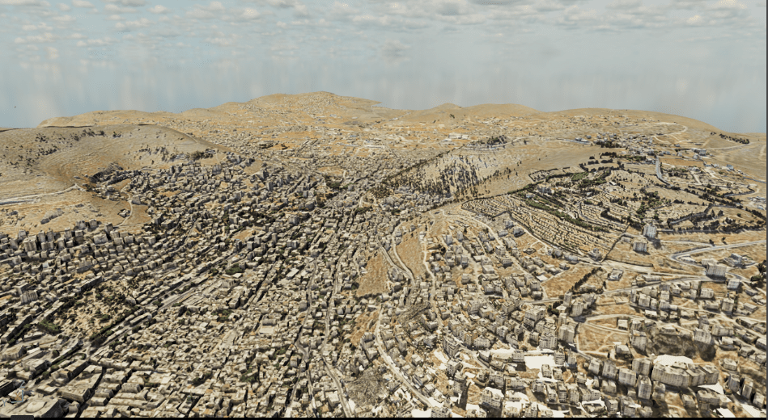
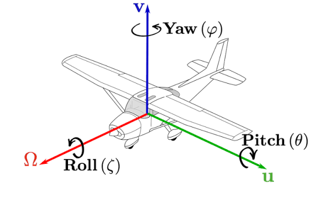
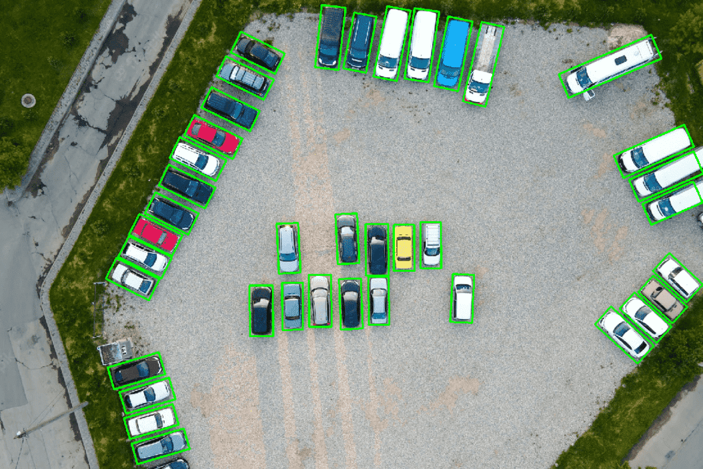
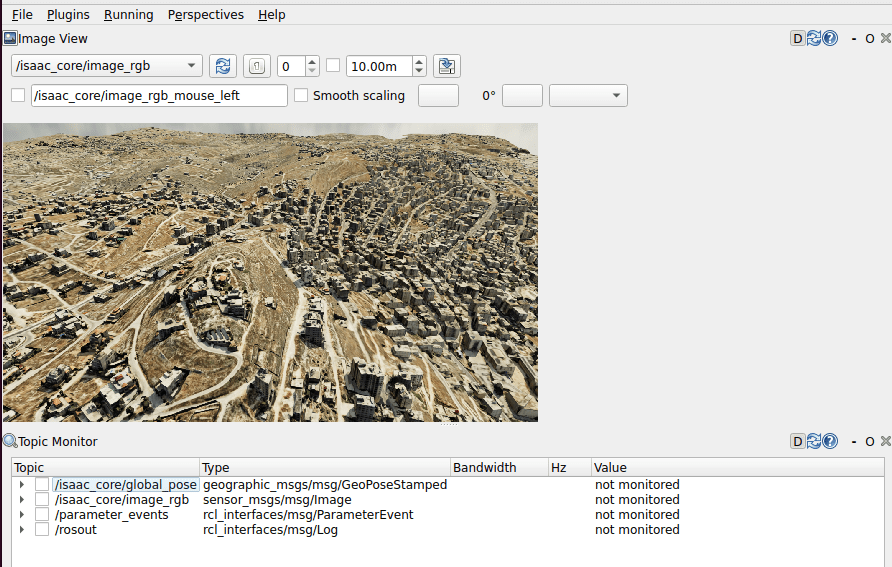
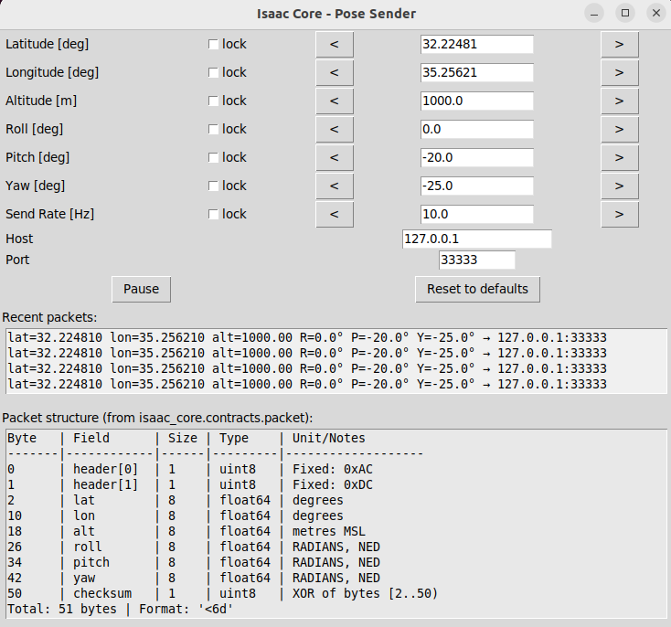

# isaac_core 🌍

Fly a camera over real-world 3D terrain in NVIDIA Isaac Sim 6, driven by position and orientation
you send from your own source.

You give it a latitude, longitude, altitude and attitude - over a UDP packet or a ROS2 topic - and
it puts a camera there, above streamed Cesium 3D Tiles terrain. It publishes the camera image, the
camera's geodetic pose and an RTSP video stream, plus optional robotics and computer-vision features.
Everything is configured in a single TOML file, while allowing adding features without changing the source code.



**Status:** working end to end. 1590 tests pass with no GPU, no Isaac Sim and no ROS2 installed.

---

## Contents 📑

- [System requirements](#system-requirements)
- [Installation](#installation)
- [Running the simulation](#running-the-simulation)
- [Features](#features)
- [ROS2 topics](#ros2-topics)
- [The UDP pose packet](#the-udp-pose-packet)
- [Conventions](#conventions)
- [Configuration](#configuration)
- [Scripting with the devkit](#scripting-with-the-devkit)
- [Debug tools](#debug-tools)
- [Adding your own feature layer](#adding-your-own-feature-layer)
- [Troubleshooting](#troubleshooting)
- [Development](#development)
- [Further documentation](#further-documentation)

---

## System requirements 🖥️

<details>
<summary><b>NVIDIA Isaac Sim 6.0.1 or newer</b></summary>

This repo was developed & tested on 6.0.1-rc.7.

Isaac Sim 6.0.1 install guide:

At this link you can download Isaac sim version 6.0.1 for Linux(x86_64) as a zip:
https://docs.isaacsim.omniverse.nvidia.com/6.0.1/installation/download.html

Then unzip it to `~/isaacsim`:
```bash
mkdir ~/isaacsim
cd ~/Downloads
unzip "isaac-sim-standalone-6.0.1-linux-x86_64.zip" -d ~/isaacsim
```

After unzip'ing you should run the post install script (only once after installing per machine):
```bash
cd ~/isaacsim
./post_install.sh
```

At this point you should be set to run Isaac Sim 6.0.1 for the first time:
```bash
cd ~/isaacsim
./isaac-sim.sh
```
`isaac-core doctor` will find your install and reports the version it accepted.

</details>

<details>
<summary><b>System Python 3.10 or newer</b></summary>

Isaac Sim bundles inside of it python 3.12.
On top of Isaac Sim's Python  you should have Python 3.10+ installed locally on your machine:
```bash
sudo apt update
sudo apt install -y python3.10 python3.10-dev
```

</details>

<details>
<summary><b>A GPU that Isaac Sim 6 supports</b></summary>

NVIDIA officially recommend the latest version of NVIDIA's driver for your GPU.
You should install GPU driver version 580+ in order to run Isaac Sim 6.0.1

Start by removing your current GPU driver:
```bash
sudo apt-get remove --purge '^nvidia-.*'
```
Next install your desired GPU driver:
```bash
sudo apt update
sudo apt install nvidia-driver-535
```
At this point your new GPU driver should be set, reboot and verify:
```bash
sudo reboot
nvidia-smi
```

</details>

<details>
<summary><b>A Cesium 3D Tiles server</b></summary>

The terrain is streamed, so you need a tileset URL this machine can reach - or your own locally hosted tileset server :

```toml
[cesium]
tileset_server_url = "http://10.44.134.160:8088"
```

Without a reachable tileset the simulator still runs and the camera still moves, but you will see no ground.

</details>

<details>
<summary><b>Local apt packages</b></summary>

```bash
# Needed for the pose-sender GUI
sudo apt install python3-tk
```

</details>

<details>
<summary><b>ROS2 Humble - optional</b></summary>

Only needed for ROS2 pose input and for output publishing topics. Everything else, including the UDP pose input and the RTSP stream, works without it.
You can follow the installation guide here:
https://docs.ros.org/en/humble/Installation/Ubuntu-Install-Debs.html
make sure you install the full desktop package:
```bash
sudo apt install ros-humble-desktop-full
```

</details>

---

## Installation 📦

```bash
./scripts/setup.sh [--isaac-path /path/to/isaacsim]
```

Five steps the script runs, in order:

1. `pip install --user -r requirements.txt` - runtime dependencies into system Python
2. `pip install --user -e .` - this package into system Python
3. `$ISAAC_PATH/python.sh -m pip install -e ".[sim]"` - the same package into Isaac's Python 3.12
4. `scripts/link_extensions.sh` - symlink the OmniGraph extensions into `extsUser`
5. `colcon build --packages-select isaac_core_ros2_msgs` - build the custom ROS2 messages
   (skipped if you have no ROS2)

Then check the environment:

```bash
isaac-core doctor
```

`doctor` reports what it found, what it could not find, and the exact command to fix each problem. It
is the first thing to run when something is wrong.

---

## Running the simulation 🚀

```bash
isaac-core run
```

That opens the `earth` scene, mounts a camera, and starts the control plane on `127.0.0.1:8760`.
Add `--set sim.headless true` for no window.

Now send it a pose. In a second terminal:

```bash
python3 ./scripts/send_test_pose.py hold
```

The camera holds at the scene's reference point (32.22481 N, 35.25621 E, 1000 m) at 30 Hz until you
press Ctrl+C.

<details>

<summary><b>To fly instead:</b></summary>

```bash
python3 ./scripts/send_test_pose.py orbit --radius-m 800 --duration-s 60
python3 ./scripts/send_test_pose.py path --speed-mps 50
```

</details>

### Confirm it is working

Read the live pose out of the running stage:

```bash
isaac-core-inspect --poll 0.5
```

Expected output (numbers depend on what you sent):

```
    #          Translate (x, y, z)               Quaternion (w, x, y, z)
    1  T=(     0.000,      0.000,    483.300)  Q=(0.6830, -0.1830, 0.1830, 0.6830)
```

If those numbers change as you fly, the pipeline works. `Translate z` is your altitude minus the
scene's reference altitude: 1000 − 516.7 = 483.3.

---

## Features

Features are switched on in `[features] enabled`, except the camera, which follows the vehicle's
`pose_source`. A default run gives you the UDP camera.

<details>
<summary><b>Camera and pose input</b></summary>

The camera is mounted per vehicle and driven by whichever pose source you choose:

```toml
[vehicles.drone_0]
pose_source = "udp"          # or "ros"

[vehicles.drone_0.cameras.eo]
fov_deg = 60.0
width = 1280
height = 720
```

- `udp` - the [51-byte packet](#the-udp-pose-packet) on port 33333. No ROS2 needed.
- `ros` - `NavSatFix` + `PoseStamped`, as published by MAVROS.

Either way the camera publishes `image_rgb` and `global_pose` while also streaming over RTSP. Choosing a source pulls in the layer
that implements it, so you do not list it under `[features]` yourself.

</details>

<details>
<summary><b>Camera gimbal</b></summary>

Aim the camera independently of the airframe. Angles are offsets on top of the vehicle's attitude.

```toml
[vehicles.drone_0.gimbal]
start_pitch_deg = -15.0    # camera tilted down at launch
max_rate_deg_s  = 20.0     # omit or 0 to snap instantly
rotation_frame  = "body"   # the gimbal is bolted to the airframe (keep this as "body")
```

```python
with Sim.attach() as session:
    session.set_gimbal(pitch_deg=-30.0)     # slews at max_rate_deg_s
    session.set_gimbal(yaw_deg=90.0)        # axes you omit stay where they are
```

- `+pitch` aims the camera **up**
- `+roll` drops the **right** side of the image (clockwise)
- `+yaw` swings the camera **right**

`set_gimbal` returns as soon as the target is accepted, not when the camera arrives - with a rate
limit the move takes time. Poll `get_pose()` to watch it get there.



**Single vehicle only.** With more than one vehicle configured it refuses and tells you so, rather
than aiming the wrong one.

</details>

<details>
<summary><b>Frame capture</b></summary>

```python
with Sim.attach() as session:
    session.capture_frame("image.png")                          # camera resolution
    session.capture_frame("4k_pic.png", width=3840, height=2160)  # 4K from a 720p window
```

Capture resolution is independent of the window. Paths are resolved under
`sim.control_plane.output_root` and confined to it. Width and height must be given together. The
return value reports the path written and the resolution used.

**Single vehicle only**, same as the gimbal.

</details>

<details>
<summary><b>Distance sensor</b></summary>

A laser rangefinder, boresighted with the camera - it measures along the camera's own axis,
so the reading matches the centre of frame.

```toml
[features]
enabled = ["camera_udp", "distance_sensor"]

[vehicles.drone_0.distance_sensor]
min_range_m = 0.2
max_range_m = 5000.0
```

Publishes `sensor_msgs/msg/Range` on `/isaac_core/distance_sensor`. Readings beyond the rated limits saturate at min/max value.

</details>

<details>
<summary><b>Bounding boxes</b></summary>

Occlusion-aware 2D boxes for labelled objects, each with the object's geodetic position.

```toml
[features]
enabled = ["camera_udp", "bbox"]
```

Publishes `isaac_core_ros2_msgs/msg/FrameBboxes` on `/isaac_core/bbox` as **parallel arrays**. Index `i` is the same object in every array:

```python
for i in range(len(msg.target_name)):
    if msg.is_visible[i]:
        print(msg.target_name[i], msg.x1[i], msg.y1[i], msg.lat[i], msg.lon[i])
```

Needs the custom message package built and sourced:

```bash
source ~/IsaacSim-ros_workspaces/humble_ws/install/setup.bash
```



</details>

<details>
<summary><b>RTSP video</b></summary>

Every camera streams H.264 over RTSP the whole time the simulator is up. No flag, no separate
process.

```bash
# To open the stream:
ffplay rtsp://127.0.0.1:8554/stream
```

```toml
[vehicles.drone_0.cameras.eo]
rtsp_port = 8554
rtsp_mount_path = "/stream"    # unset = derived, namespaced when there is more than one camera
```

Each simultaneous stream needs its own port, so ports are allocated as `rtsp_port + vehicle index`.

</details>

<details>
<summary><b>Multiple vehicles</b></summary>

Declare more than one vehicle and each gets its own camera, ports, topic namespace and prim mount.

```toml
[vehicles.lead]
[vehicles.lead.cameras.eo]

[vehicles.wing]
[vehicles.wing.cameras.eo]
```

| | `lead` | `wing` |
|---|---|---|
| UDP pose port | 33333 | 33334 |
| Pose topic | `/isaac_core/lead/global_pose` | `/isaac_core/wing/global_pose` |
| Image topic | `/isaac_core/lead/image_rgb` | `/isaac_core/wing/image_rgb` |
| RTSP | `8554/lead/stream` | `8555/wing/stream` |
| Prim mount | `/World/Environment/lead` | `/World/Environment/wing` |

Topics are namespaced **only** when there is more than one vehicle, so a single-vehicle setup keeps
the plain names.

Most control calls take an optional `vehicle`, defaulting to the first declared:

```python
session.set_pose(vehicle="wing", lat_deg=32.2, lon_deg=35.3, alt_m=900.0)
print(session.get_pose(vehicle="wing"))
```

An unknown name is rejected with the list of configured vehicles. `set_gimbal` and `capture_frame`
are single-vehicle only and refuse rather than guess.

The viewport shows the first vehicle declared. Every other vehicle still gets its own image topic and
RTSP stream. Point the viewport elsewhere with `sim.viewport_camera`.

</details>

<details>
<summary><b>Recording</b></summary>

Record poses and images to disk from your own script, on system Python with ROS2 sourced:

```python
from isaac_core.devkit.recording import Recorder
```

Video writing needs `opencv-python`, pose recording does not.

</details>

---

## ROS2 topics 📡

All topics sit under `/isaac_core`, namespaced per vehicle when there is more than one.

### Published

| Topic | Type | Enabled by |
|---|---|---|
| `global_pose` | `geographic_msgs/msg/GeoPoseStamped` | camera layer |
| `image_rgb` | `sensor_msgs/msg/Image` | camera layer |
| `distance_sensor` | `sensor_msgs/msg/Range` | `distance_sensor` |
| `bbox` | `isaac_core_ros2_msgs/msg/FrameBboxes` | `bbox` |



### Subscribed

Only when `pose_source = "ros"`:

| Topic | Type |
|---|---|
| `/mavros/global_position/global` | `sensor_msgs/msg/NavSatFix` |
| `/mavros/local_position/pose` | `geometry_msgs/msg/PoseStamped` |

DDS discovery takes a few seconds after startup.

### Custom messages

`FrameBboxes` ships as a normal ROS2 package in
`ros2/isaac_core_ros2_msgs/`. `setup.sh` builds it. By hand:

```bash
cp -r ros2/isaac_core_ros2_msgs ~/IsaacSim-ros_workspaces/humble_ws/src/
cd ~/IsaacSim-ros_workspaces/humble_ws
colcon build --packages-select isaac_core_ros2_msgs
source install/setup.bash
```

---

## The UDP pose packet 📨

51 bytes, little-endian.

| Offset | Size | Field | Type | Notes |
|---|---|---|---|---|
| 0 | 1 | header[0] | uint8 | `0xAC` |
| 1 | 1 | header[1] | uint8 | `0xDC` |
| 2 | 8 | latitude | float64 | degrees |
| 10 | 8 | longitude | float64 | degrees |
| 18 | 8 | altitude | float64 | metres, sea level = 0 |
| 26 | 8 | roll | float64 | **radians**, NED |
| 34 | 8 | pitch | float64 | **radians**, NED |
| 42 | 8 | yaw | float64 | **radians**, NED |
| 50 | 1 | checksum | uint8 | XOR of bytes [2, 50) |

Angles are radians on the wire. The GUI tools show degrees and convert for you.

**A bad packet holds the last good pose** rather than dropping to zero - wrong length, bad header,
bad checksum, or an impossible value. A frozen camera means nothing is arriving, not necessarily that something
crashed.

Default port 33333, allocated as `base + vehicle index`.

---

## Conventions 🧭

The thing we got confused by the most.

### Frames

- **On the wire:** LLA position plus roll/pitch/yaw in **NED**.
- **In the stage:** **ENU**, because Isaac Sim and Cesium both use ENU.
- **Body axes:** +X nose, +Y left wing, +Z up.

### NED to ENU

```
roll_enu  =  roll_ned
pitch_enu = -pitch_ned
yaw_enu   = -yaw_ned + pi/2      (normalised to [-pi, pi])
```

So `+pitch` raises the nose, `+roll` drops the right wing, and `+yaw` turns right.

### The reference point

```toml
[geo]
enu_reference = { lat_deg = 32.22481, lon_deg = 35.25621, alt_m = 516.7 }
```

A pose at exactly that lat/lon sits at stage origin, and stage Z is `altitude - alt_m`. This must
match the `CesiumGeoreference` in the scene, a mismatch over 1 m is reported at startup with both
values and how to fix it.

Use the same altitude datum for your poses and for `enu_reference.alt_m`. What matters is that they
agree.

---

## Configuration ⚙️

Everything lives in a single file. [`config/default.toml`](config/default.toml) which includes inline documents for every key,
 it is the file to copy as a new project starting point.

```
package defaults -> --config <file> / $ISAAC_CORE_CONFIG -> env vars -> --set flags -> runtime patch
```

Later wins. Environment variables nest with double underscores:
`ISAAC_CORE__VEHICLES__DRONE_0__CAMERAS__EO__FOV_DEG=90`.

```bash
isaac-core config dump            # the fully resolved config
isaac-core config explain <key>   # which source won, and what the others offered
```

Invalid values are rejected at load with the key, the value and what to do instead.

---

## Scripting with the devkit 🐍

```python
from isaac_core.devkit import Sim

# Attach to a simulator someone else started -- possibly on another machine.
with Sim.attach(host="192.168.1.50", port=8760) as session:
    print(session.get_capabilities())
    print(session.get_pose())
    session.pause()
    session.step(count=10)
    session.resume()
```

`attach` leaves the simulator running when the block ends. `launch` owns the Isaac Sim process and stops it:

```python
with Sim.launch(headless=True, scene="earth") as session:
    session.capture_frame("shot.png")
```

### Sending poses from your own code

```python
from isaac_core.devkit.transport import UdpPoseTransport, pace
from isaac_core.vehicle import OrbitTrajectory

trajectory = OrbitTrajectory(
    center_lat_deg=32.22481, center_lon_deg=35.25621,
    radius_m=800, height_m=1000, speed_mps=30, orbit_duration_s=60,
)
transport = UdpPoseTransport(host="127.0.0.1", port=33333)
print(f"sent {pace(trajectory.poses(rate_hz=30.0), transport, rate_hz=30.0)} packets")
```

---

## Debug tools 🔧

```bash
isaac-core-inspect                 # state, capabilities, live pose, config
isaac-core-inspect --poll 0.5      # watch the pose change
isaac-core-pose-sender             # GUI for flying by hand
isaac-core-pose-sender --check     # validate config and exit, no window
isaac-core-mavlink                 # bridge MAVLink into the UDP port
```

`isaac-core-inspect` reads the live prim transform through the control plane, which is how you
confirm from outside the process that pose input is reaching the camera.



---

## Adding your own feature layer 🧩

A sensor, a publisher or anything else can be added without changing `isaac_core` source code. A layer is a
directory with a manifest and optionally a USD file:

```
my_layers/thermal_cam/
├── layer.toml
└── thermal_cam.usda
```

```toml
[assets]
layer_search_paths = ["/home/you/my_layers"]

[features]
enabled = ["camera_udp", "thermal_cam"]
```

The manifest declares what the layer needs from the stage (`requires`), what it provides
(`provides`), and how config flows into prim attributes (`[[bindings]]`). Your layer's own settings
live under `[layers.<your_id>]`.

For a layer that ships as a package, register it under
`[project.entry-points."isaac_core.layers"]` and no search path is needed.

Full walkthrough, including the USD side and the traps: [docs/authoring_layers.md](docs/authoring_layers.md).

---

## Troubleshooting 🔍

### No terrain, just empty space

- **No reachable tileset.** Check `cesium.tileset_server_url` from the machine running Isaac. An
  unreachable URL is valid USD that draws nothing, silently.
- **Missing Cesium extension.** It installs into `~/.local/share/ov/data/exts/v2`, which Isaac's
  Python experience does not search by default. `sim.extension_search_paths` and `sim.extensions`
  handle this in the shipped config.
- **`sim.renderer` set to `MinimalRendering`.** It skips the RTX passes terrain needs (does not show cesium tiles).
Use a different renderer such as `RaytracedLighting`.

### The camera seems frozen

Usually the window is showing Kit's default camera, not the vehicle's. Set `sim.viewport_camera`, and
confirm the pose is arriving with `isaac-core-inspect --poll 0.5`.

Only one process can own a UDP port, so an earlier sender still running at 30 Hz will beat a new one:

```bash
pgrep -af 'send_test_pose|pose_sender' || echo "no senders running"
```

When all senders stop, the last good pose is held by design.

### Nothing moves at all

`OnTick` does not fire unless the timeline is playing. The runtime presses play automatically, if you
stopped it in the GUI, press play again.

### No ROS2 topics

DDS discovery takes a few seconds. For `bbox`, confirm you sourced the workspace containing
`isaac_core_ros2_msgs`. Check `ROS_DOMAIN_ID` matches your other nodes - it is inherited from the
environment unless you pin `ros2.domain_id`.

### `Address already in use` on the RTSP port

Isaac ignores `SIGTERM`, so a simulator from an earlier session can still hold the port:

```bash
pgrep -af 'isaac_core.sim' && kill -9 <pid>
```

### A new OGN node does not appear

```bash
rm -rf ~/.cache/ov/ogn_generated/*/isaac_core_ogn.*
```

Then restart. `scripts/link_extensions.sh` does this for you.

### Startup segfault, roughly one launch in three

Inside Kit's own `update_app()`, it reproduces with our extensions disabled. Stale `/tmp/carb.*`
directories make it worse:

```bash
rm -rf /tmp/carb.*
```

### Frame rate dips while flying

Terrain is streamed, so new ground means waiting on downloads. Measured: 7 fps on a first pass over
fresh terrain, 59.9 on the second pass over the same ground. try adjusting cesium tile settings for better results.

### Cesium cache growing without limit

Long sessions grow `~/.cache/ov/cesium-request-cache.sqlite-wal`. Delete it, or set
`cesium.delete_cache_on_launch = true`.

### Stale `$ISAACSIM_PATH`

`isaac-core doctor` finds the real install anyway. If it cannot, pass `--isaac-path` to `setup.sh`.

---

## Development 🛠️

```bash
python3 -m pytest -q                              # the whole suite, no GPU needed
PYTHONPATH=src lint-imports                       # layering contracts
pre-commit run ruff --files <paths>               # lint
pre-commit run mypy --files <paths>               # types
```

Files may be untracked, and `--all-files` silently skips those, so pass `--files` explicitly.

There is no virtualenv: tools install with `pip install --user`. Pinned versions in
`requirements-dev.txt` match `.pre-commit-config.yaml`, so the terminal and the commit gate agree.

---

## Further documentation 📚

| Document | What it covers |
|---|---|
| [docs/first_run.md](docs/first_run.md) | The first flight in detail, with what to check at each step |
| [docs/architecture.md](docs/architecture.md) | How the packages fit together and why the kernel is pure |
| [docs/authoring_layers.md](docs/authoring_layers.md) | Writing your own feature layer, including the USD side |
| [docs/ros2_and_python.md](docs/ros2_and_python.md) | Why `rclpy` cannot run inside Isaac Sim 6 |
| [docs/migrating_from_2023.md](docs/migrating_from_2023.md) | What changed from the previous generation |
| [docs/dev/roadmap.md](docs/dev/roadmap.md) | What is not built yet |
| [docs/development-log.md](docs/development-log.md) | Engineering log and design decisions |

---

## License

[Apache License, Version 2.0](LICENSE)
